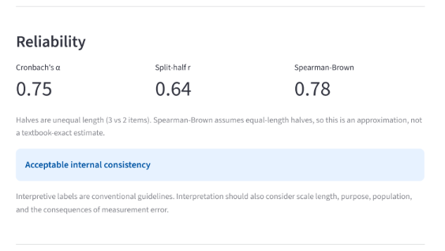
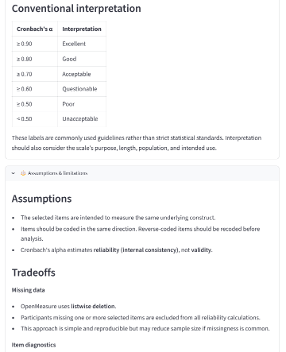

# OpenMeasure Lab

An open-source validation toolkit for research data, measures, models, and programs.

[](https://openmeasure.streamlit.app)
[](https://github.com/victoriamccray/openmeasure)

OpenMeasure brings together statistical methods, transparent reporting, and plain-language interpretation to help researchers evaluate measurements, datasets, analytical models, and program evaluations.

OpenMeasure is designed for researchers and practitioners working in community health, social services, education, public policy, and applied research. The toolkit emphasizes validation methods that are accessible, reproducible, transparent, and adaptable across disciplines.

## Modules

### Measurement Validation

Evaluates the consistency and quality of research instruments.

**Available:** Reliability v0.1

### Data Validation

Evaluates data quality, completeness, consistency, and integrity before analysis.

*Under development.*

### Model Validation

Evaluates predictive performance, robustness, calibration, subgroup behavior, and fairness using transparent, documented metrics.

OpenMeasure does not prescribe a single definition of fairness. Rather than producing one composite "is this model fair" score, this module reports multiple established metrics side by side, along with their assumptions, tradeoffs, and known mathematical incompatibilities.

**In progress:** core fairness metrics are built and tested (pre-model bias detection, demographic parity, equal opportunity, predictive equality, calibration by group, and a goal-based metric recommender). The interactive page is still being finalized.

### Program Validation

Supports evaluation of interventions using research designs and statistical methods appropriate to the program, population, and evaluation goals.

**Available:** Impact Evaluation v0.1

## Design principles

Every module follows the same principles:

- Transparent statistical methods
- Reproducible analyses
- Explicit assumptions and limitations
- Plain-language interpretation
- Documented references
- Responsible use aligned with research and professional ethics
- Method recommendations that explain their reasoning, rather than requiring the user to already know which method to run
- Research case studies grounding each module's assumptions in published, citable examples

## Quickstart

```bash
git clone https://github.com/victoriamccray/openmeasure.git
cd openmeasure
pip install -r requirements.txt
streamlit run Home.py
```

## Repository structure

```
openmeasure/
├── Home.py
├── pages/
│   ├── 1_Reliability.py
│   ├── 2_Program_Evaluation.py
│   └── 3_Fairness.py
├── modules/
│   ├── reliability/
│   │   ├── README.md
│   │   ├── core/
│   │   ├── tests/
│   │   └── sample_data/
│   ├── program_evaluation/
│   │   ├── README.md
│   │   ├── core/
│   │   ├── tests/
│   │   └── sample_data/
│   └── fairness/
│       ├── README.md
│       ├── core/
│       ├── tests/
│       └── sample_data/
├── shared/
│   ├── report.py
│   └── case_studies.py
├── docs/
│   └── design-standards.md
└── requirements.txt
```

Each module documents its methods, assumptions, limitations, references,
and intended use. Shared design standards keep reporting, interpretation,
and presentation consistent across the toolkit.

## Current release

### Reliability v0.1

- Cronbach's alpha
- Corrected item-total correlations
- Alpha if item dropped
- Odd-even split-half reliability (all-items and equal-halves options)
- Spearman-Brown correction
- Listwise missing-data handling
- Plain-language interpretation, assumptions, and limitations

See `modules/reliability/README.md` for methodology and references.

### Program Evaluation v0.1

- Welch's t-test for two-group comparisons
- Welch's one-way ANOVA with Games-Howell post-hoc for three or more groups
- Chi-square test of independence for categorical outcomes
- Paired t-test for pre/post designs
- Sensitivity analysis across multiple codings of multi-select demographic fields
- A method recommender that infers study design from the data and explains its reasoning, with safeguards against common configuration mistakes (e.g. selecting an identifier column as a group variable)

See `modules/program_evaluation/README.md` for methodology and references.

### Model Validation (Fairness) v0.05

- Pre-model bias detection: disparate impact and statistical parity difference on raw outcome labels
- Post-model fairness metrics: demographic parity, equal opportunity, predictive equality, and calibration by group
- A goal-based metric recommender: states which metric fits a stated fairness goal, and flags when two selected goals are mathematically incompatible (per Kleinberg, Mullainathan, & Raghavan, 2017; Chouldechova, 2017)

See `modules/fairness/README.md` for methodology and references.

Future releases will expand OpenMeasure with a data validation module and continued fairness module development.

## Screenshots

Visit the live application: https://openmeasure.streamlit.app

### Home


### Reliability Analysis



### Assumptions & Limitations



## Running tests

```bash
pip install -r requirements.txt
pytest modules/reliability/tests/ -v
pytest modules/program_evaluation/tests/ -v
pytest modules/fairness/tests/ -v
```

## Contributing

OpenMeasure is an early-stage project. Researchers, analysts, clinicians, technologists, and evaluators are welcome to contribute.

Please open an issue before submitting a pull request so proposed changes can be discussed and aligned with the project's scope and design principles. See `CONTRIBUTING.md` for details.

## Citation

If you use OpenMeasure in your work, please cite it, see `CITATION.cff` and `CITATION.md` for citation formats.

## License

See `LICENSE`.

## Authorship

OpenMeasure was created and is maintained by **Victoria McCray**. Contributions are welcome (see `CONTRIBUTING.md`). Portions of the codebase were developed with the assistance of generative AI tools for code drafting, debugging, and documentation. All statistical methods were independently verified, and all design and implementation decisions were made by the project author.

See `docs/AUTHORSHIP.md` for details.
