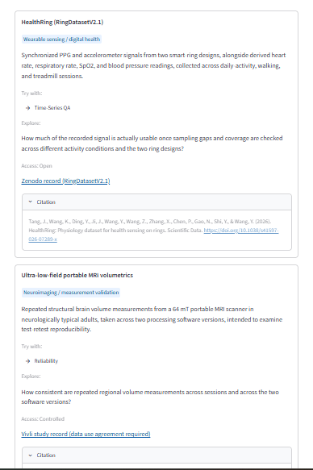
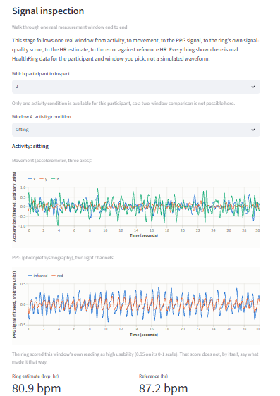
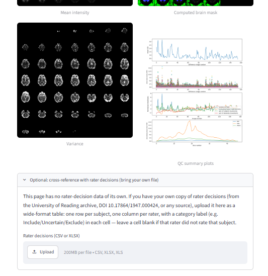

# OpenMeasure Lab

An open-source validation toolkit for research data, measures, models, and programs.

[](https://openmeasure.streamlit.app)
[](https://github.com/victoriamccray/openmeasure)

OpenMeasure brings together statistical methods, transparent reporting, and plain-language interpretation to help researchers evaluate measurements, datasets, analytical models, and program evaluations.

OpenMeasure is designed for researchers and practitioners working in community health, social services, education, public policy, and applied research. The toolkit emphasizes validation methods that are accessible, reproducible, transparent, and adaptable across disciplines.

## Modules

### Measurement Validation

Evaluates the consistency and quality of research instruments.

**Available:** Reliability v0.1

### Data Validation

Evaluates data quality, completeness, consistency, and integrity before analysis.

**Available:** Time-Series QA v0.1

### Model Validation

Evaluates predictive performance, robustness, calibration, subgroup behavior, and fairness using transparent, documented metrics.

OpenMeasure does not prescribe a single definition of fairness. Rather than producing one composite "is this model fair" score, this module reports multiple established metrics side by side, along with their assumptions, tradeoffs, and known mathematical incompatibilities.

**Available:** Fairness v0.05 (pre-model bias detection and a goal-based metric recommender). Post-model metrics (equal opportunity, predictive equality, equalized odds, calibration by group) are planned for a future release.

### Program Validation

Supports evaluation of interventions using research designs and statistical methods appropriate to the program, population, and evaluation goals.

**Available:** Impact Evaluation v0.1

### Cross-Cutting Validation

Connects findings across the other modules rather than producing a validation result of its own.

**Available:** Cross-Analysis Implications v0.1

## Guides and worked examples

A few pages sit outside the validation-workflow catalog above: they record nothing to the cross-analysis handoff and carry no lifecycle stage, because they are not analyses themselves.

- **Explore Real Data** points to real, citable research datasets and the workflow each fits, without prescribing columns or expected results, so practicing validation judgment on real data stays the point.
- **Method Selection** is a one-question decision tree that starts from what you're trying to determine (e.g. "Did my program cause the change I'm seeing?") and routes to the workflow or research journey suited to it, explaining why.
- **Resources** lists existing toolkits, methods guides, and dataset directories outside OpenMeasure. See `shared/resources.py`.
- **Research Journeys** are guided worked examples of what a real dataset supports, grouped by domain (Multi-Modal Health Imaging, Social Impact Evaluation, Responsible AI) in `shared/research_journeys.py`. They occupy the "Research Question" stage that no numbered workflow covers. The **Wearables Research Journey** (v0.1 prototype, HealthRing dataset) is the most built-out of them: each stage unlocks only after a decision or inspection, including a real leakage-consequence comparison between participant-level and window-level train/test splits, a signal-quality retention tradeoff, and a per-condition robustness check, ending in a compact validation record with WIGOR checklist coverage. It is a prototype of OpenMeasure's immersive worked-example architecture, not a general Wearables module, and never bundles or redistributes the underlying dataset. See `modules/healthring/README.md`.

## Design principles

Every module follows the same principles:

- Transparent statistical methods
- Reproducible analyses
- Explicit assumptions and limitations
- Plain-language interpretation
- Documented references
- Responsible use aligned with research and professional ethics
- Method recommendations that explain their reasoning, rather than requiring the user to already know which method to run
- Research case studies grounding each module's assumptions in published, citable examples

## Quickstart

```bash
git clone https://github.com/victoriamccray/openmeasure.git
cd openmeasure
pip install -r requirements.txt
streamlit run Home.py
```

## Repository structure

```
openmeasure/
├── Home.py
├── pages/
│   ├── Overview.py
│   ├── 1_Reliability.py
│   ├── 2_Impact_Evaluation.py
│   ├── 3_Fairness.py
│   ├── 4_Time_Series_QA.py
│   ├── 5_Cross_Analysis_Implications.py
│   ├── Explore_Real_Data.py
│   ├── Method_Selection.py
│   └── HealthRing_Worked_Example.py
├── modules/
│   ├── reliability/
│   │   ├── README.md
│   │   ├── core/
│   │   ├── tests/
│   │   └── sample_data/
│   ├── program_evaluation/
│   │   ├── README.md
│   │   ├── core/
│   │   ├── tests/
│   │   └── sample_data/
│   ├── fairness/
│   │   ├── README.md
│   │   ├── core/
│   │   ├── tests/
│   │   └── sample_data/
│   ├── time_series_qa/
│   │   ├── README.md
│   │   ├── core/
│   │   ├── tests/
│   │   └── sample_data/
│   ├── validation_chain/
│   │   ├── README.md
│   │   ├── core/
│   │   └── tests/
│   └── healthring/
│       ├── README.md
│       ├── core/
│       ├── tests/
│       └── sample_data/   # no bundled data; see the module README
├── shared/
│   ├── catalog.py
│   ├── report.py
│   ├── validation.py
│   ├── handoff.py
│   ├── progress.py
│   ├── case_studies.py
│   ├── datasets.py
│   ├── method_guide.py
│   └── tests/
├── scripts/
│   └── healthring_prototype.py   # exploratory script, not part of the app
├── docs/
│   └── design-standards.md
└── requirements.txt
```

Each module documents its methods, assumptions, limitations, references,
and intended use. Shared design standards keep reporting, interpretation,
and presentation consistent across the toolkit.

## Current release

### Reliability v0.1

- Cronbach's alpha
- Corrected item-total correlations
- Alpha if item dropped
- Odd-even split-half reliability (all-items and equal-halves options)
- Spearman-Brown correction
- Listwise missing-data handling
- Plain-language interpretation, assumptions, and limitations

See `modules/reliability/README.md` for methodology and references.

### Program Validation (Impact Evaluation) v0.1

- Welch's t-test for two-group comparisons
- Welch's one-way ANOVA with Games-Howell post-hoc for three or more groups
- Chi-square test of independence for categorical outcomes
- Paired t-test for pre/post designs
- Sensitivity analysis across multiple codings of multi-select demographic fields
- A method recommender that infers study design from the data and explains its reasoning, with safeguards against common configuration mistakes (e.g. selecting an identifier column as a group variable)

See `modules/program_evaluation/README.md` for methodology and references.

### Model Validation (Fairness) v0.05

- Pre-model bias detection: disparate impact and statistical parity difference on raw outcome labels
- A goal-based metric recommender: for a stated fairness goal, recommends a metric and explains its reasoning, assumptions, tradeoffs, and alternatives, including why competing fairness definitions can be mutually incompatible (per Kleinberg, Mullainathan, & Raghavan, 2017; Chouldechova, 2017)

Post-model metrics (equal opportunity, predictive equality, equalized odds, calibration by group) are planned for a future release.

See `modules/fairness/README.md` for methodology and references.

### Data Validation (Time-Series QA) v0.1

- Gap detection against an inferred or supplied sampling frequency, using a calendar-aware expected grid so month lengths, leap years, and daylight saving changes do not create false gaps
- Duplicate timestamp detection, including whether duplicated rows hold conflicting values
- Chronological order and interval regularity checks
- Value completeness and longest unavailable run, counting both observations that never arrived and rows that arrived empty
- Coverage per period, measured against expected observations rather than rows present, so absent observations cannot hide behind the rows that are there
- A recommender that states which checks are defensible for the series and why, without deciding whether any finding is an error and without cleaning anything

See `modules/time_series_qa/README.md` for methodology, non-goals, and references.

### Cross-Analysis Implications v0.1

- Reports how many observations each analysis received, retained, and excluded, and why
- Groups analyses by dataset, so results from different uploads are labeled rather than compared directly
- Reports counts only: no overall validation score, no combined retention percentage, and no acceptable-exclusion threshold
- States plainly that two analyses of the same file usually retain different rows, and that the overlap between those subsets is not reported

See `modules/validation_chain/README.md` for scope and non-goals.

### Wearables Research Journey v0.1 (prototype)

A guided, gated worked example, not a versioned validation module: see
"Guides and worked examples" above for what it does, and
`modules/healthring/README.md` for scope, data access, and non-goals.

Future releases will expand the data validation and fairness modules, and may
connect further findings across the research workflow.

## Interface

Visit the live application: https://openmeasure.streamlit.app

### Home


### Explore Real Data & Research Journeys







### Reliability Analysis


### Assumptions & Limitations


## Running tests

```bash
pip install -r requirements.txt
pytest modules/reliability/tests/ -v
pytest modules/program_evaluation/tests/ -v
pytest modules/fairness/tests/ -v
pytest modules/time_series_qa/tests/ -v
pytest modules/validation_chain/tests/ -v
pytest modules/healthring/tests/ -v
pytest modules/signal_pipeline/tests/ -v
pytest shared/tests/ -v
```

Each module's tests run as a separate command because every module ships its
own top-level `core` package. A single invocation across several modules
collides in Python's import cache. `.github/workflows/tests.yml` runs the same
commands in the same way.

## Contributing

OpenMeasure is an early-stage project. Researchers, analysts, clinicians, technologists, and evaluators are welcome to contribute.

Please open an issue before submitting a pull request so proposed changes can be discussed and aligned with the project's scope and design principles. See `CONTRIBUTING.md` for details.

## Citation

If you use OpenMeasure in your work, please cite it, see `CITATION.cff` and `CITATION.md` for citation formats.

## License

See `LICENSE`.

## Authorship

OpenMeasure was created and is maintained by **Victoria McCray**. Contributions are welcome (see `CONTRIBUTING.md`). Portions of the codebase were developed with the assistance of generative AI tools for code drafting, debugging, and documentation. All statistical methods were independently verified, and all design and implementation decisions were made by the project author.

See `docs/Authorship.md` for details.
